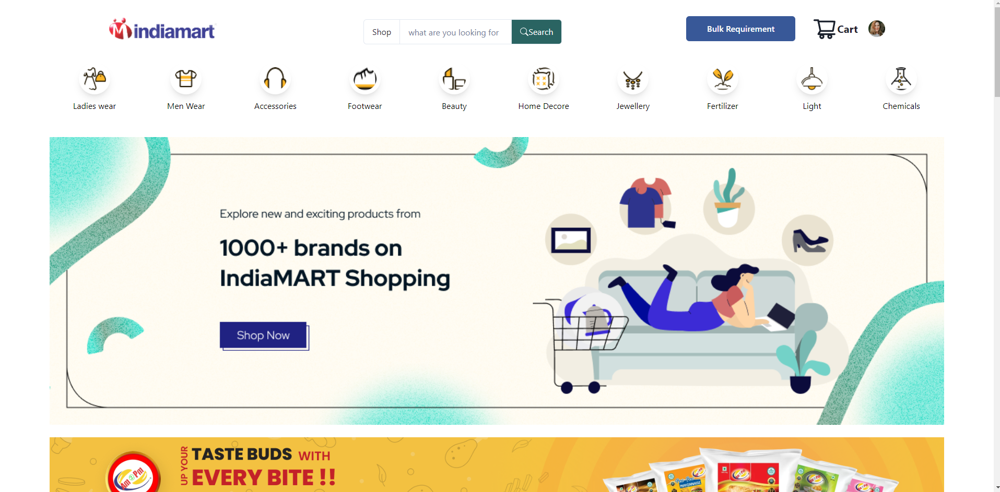
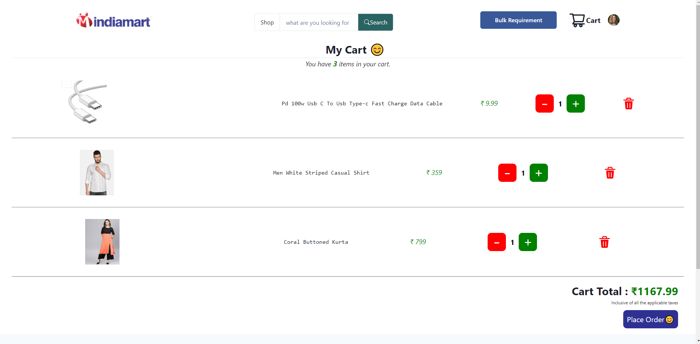
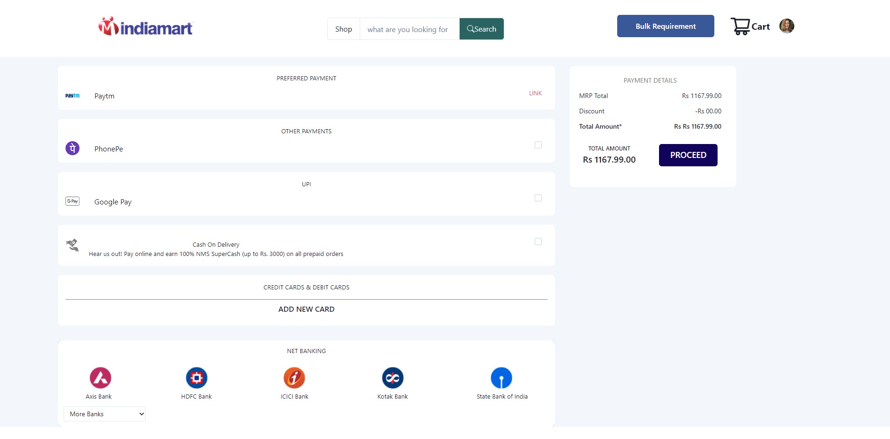

# Project Title : India_Mart_Clone


IndiaMart is an e-commerce online website for the best products of all categories for the consumer. User can buy products at best deals and offers

## Authors

- [@uttamkrshaw](https://github.com/uttamkrshaw)
- [@kripaShankarPandey](https://github.com/kripaShankarPandey)
- [@sonugupta1234](https://github.com/sonugupta1234)
- [@sp740881](https://github.com/sp740881)


## Screenshots
## Homepage


## Login Page


## Shopping Page




## Mens Page


## Womens Page


## Cart Page




## Payment Page




## Features

- Light/dark mode toggle
- Live previews
- Fullscreen mode
- Cross platform


## Run Locally

Clone the project

```bash
  git clone https://github.com/uttamkrshaw/wandering-cactus-2429
```

Go to the project directory

```bash
  cd sasta_bazar
```

Install dependencies

```bash
  npm install
```

Start the server

```bash
  npm run start
```


## Feedback

If you have any feedback, please reach out to us at uttamkr5599@gmail.com

